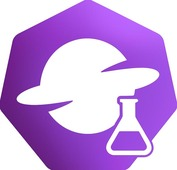

[](https://opensource.org/licenses/Apache-2.0)

Welcome to the lab repo for [Open Cluster Management (OCM)](https://open-cluster-management.io/).
This repo hosts experimental projects that anyone in the community can try out, provide feedback on, and contribute to.
Feel free to link to these projects from your own websites or repos, gauge interest, and help us improve as we iterate.

Unlike a dedicated labs GitHub org (ie: [argoproj-labs](https://github.com/argoproj-labs)),
this repo hosts all lab projects in one place.
New projects are onboarded via PR and added as subfolders, each governed by its own `OWNERS` file.
Since our community is still small compared to the [arogoproj](https://github.com/argoproj),
keeping everything together avoids unnecessary fragmentation.

For new add-on projects, please use the
[addon-contrib](https://github.com/open-cluster-management-io/addon-contrib) repo.


## Table of Contents

- [Current Projects](#current-projects)
- [Onboarding a New Project](#onboarding-a-new-project)
- [Governance](#governance)
- [Issues for Lab Projects](#issues-for-lab-projects)  
- [PRs for Lab Projects](#prs-for-lab-projects)


## Current Projects

- [fleetconfig-controller](./fleetconfig-controller/README.md): Declarative orchestrator for OCM multi-clusters.


## Onboarding a New Project

To onboard a new lab project:

1. If not already discussed with maintainers, open an issue to propose your idea.
1. Once acknowledged, create a folder named after your project and add your code/docs.
1. Add an `OWNERS` file listing the new project's maintainers.
1. Update the [Current Projects](#current-projects) section in this README with the name and a short description.  
1. Create a PR with a brief project overview and confirm the `OWNERS` file is present.  
1. An OCM maintainer will review and merge the PR.  

### GitHub Actions

All projects must follow certain conventions to ensure compatibility with the lab repository's Github Actions workflows.

#### `make` targets

All projects must define the following `make` targets:

- `check-diff`: Perform any automated formatting, Helm chart README updates, manifest generation, etc. Return a non-zero exit code if a git diff is produced.
- `test-e2e`: Invoke end-to-end tests and return an exit code accordingly.
- `test-unit`: Invoke unit tests and return an exit code accordingly.

Refer to the [Test](./.github/workflows/test.yml) and [E2E](./.github/workflows/e2e.yml) workflows for further details.

#### Helm Charts

Any projects that require a Helm chart must be structured as follows:

```bash
<project_name>
└── charts
    └── <project_name> # chart name must match project directory name
        ├── Chart.yaml
        ├── templates
        └── values.yaml
```

Furthermore, `values.yaml` must contain the following top-level values:

```yaml
image:
  repository: <project_image_repository>
  tag: <project_image_tag>
```

This is required so that a locally built image can be used consistently for Helm chart testing.

Refer to the `test-chart` job in the [Test](./.github/workflows/test.yml) workflow for further details.

## Governance

Once onboarded, each project is fully self governed by its `OWNERS` file,
which defines who can review and merge changes.
Any updates to the project maintainers are made via PR to the `OWNERS` file
and require approval from existing approvers.


## Issues for Lab Projects

When reporting a bug or requesting a feature for an existing lab project,
open an issue with the project folder name at the start of the title (ie: `dashboard - foobar bug`).
The maintainers listed in the project’s `OWNERS` file will triage your issue.


## PRs for Lab Projects

To contribute to an existing lab project,
open a PR with the project folder name at the start of the title (ie: `dashboard - fix foobar bug`).
The maintainers in the `OWNERS` file will review the PR.
